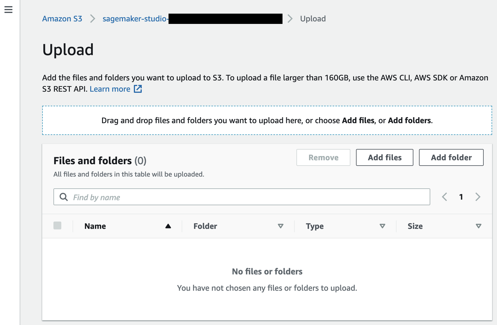

# 實驗 1 - 客戶流失（行銷）

## 議程

1. [概述](#概述)
2. [將數據集上傳S3存儲桶](#將數據集上傳S3存儲桶)
3. [將數據導入Canvas](#將數據導入Canvas)
4. [建構和訓練ML模型](#建構和訓練ML模型)
5. [使用模型生成預測](#使用模型生成預測)

 

## 概述

在本實驗室中，您將扮演為銀行工作的分析師角色。您的行銷部門要求您協助確定，即將到來營銷活動目標客戶，該活動致力於獲得新的定期存款（CDs）。他們為您提供了一個包含客戶人口統計和銀行接觸歷史的數據集。由於行銷活動的資源和預算有限，因此他們要求您使用數據來預測，哪些客戶最有可能購買新的定期存款。數據格式如下:

| 欄位名稱    | 資料型別       |
| -------------- | --------------- |
| age            | INT             |
| job            | STRING          |
| marital        | STRING          |
| education      | STRING          |
| default        | STRING (yes/no) |
| housing        | STRING (yes/no) |
| loan           | STRING (yes/no) |
| contact        | STRING          |
| month          | STRING          |
| day_of_week    | STRING          |
| duration       | INT             |
| campaign       | INT             |
| pdays          | DECIMAL         |
| previous       | INT             |
| poutcome       | STRING          |
| emp.var.rate   | DECIMAL         |
| cons.price.idx | DECIMAL         |
| cons.conf.idx  | DECIMAL         |
| euribor3m      | DECIMAL         |
| nr.employed    | INT             |
| y (target)     | STRING (yes/no) |

## 將數據集上傳S3存儲桶

第一步是下載我們將使用的數據集。您可以到[這裡](./Data/bank-marketing.csv)下載。

轉到AWS管理控制台，在控制台頂部的搜索框中尋找 **S3** , 然後去到 **S3** 服務控制台。

在S3控制台中，點擊 **sagemaker-studio-\***存儲桶。

> **sagemaker-studio-\*** 在當初建立 SageMaker Studio domain 的時候， 就已經自動建立。如果你參與 **Event Engine** 活動, 則講師會預先準備存儲桶。

點擊 **Upload**.

在上傳頁面上，拖放剛才下載的`bank-marketing.csv`文件，然後點擊頁面底部的 **Upload**。上傳完成後，您可以點擊右上角**Close**按鈕。現在，您應該看到上傳到存儲桶中的文件。

## 將數據導入Canvas

返回到Sagemaker Canvas。在左側選單上，您可以點擊第二個圖標，進入數據集部分，然後點擊 **Import**按鈕。

現在，選擇之前上傳到 **sagemaker-studio-\***存儲桶的數據集。

現在，您可以通過在其左側複選框來選擇先前上傳的`bank-marketing.csv`文件。頁面底部將彈出兩個新的按鈕： **Preview all** 和 **Import Data**。讓我們選擇第一個。

現在，您可以預覽要導入的數據集的100筆資料。完成資料檢查，確定是正確後，您可以點擊 **Import Data**.

## 建構和訓練ML模型

現在，讓我們通過點擊左邊選單上的第二個按鈕回到 **Models**部分。

點擊 **+New Model**，並為您的模型輸入名稱。

如果這是您第一次建立 Canvas模型，那麼您將看到一個彈出式歡迎，其中有關於如何通過4個簡單步驟建構您第一個模型的信息。您可以閱讀此信息，然後回到本實驗指南。

在模型視圖中，您將看到四個選項卡，它們對應於創建模型並使用它來生成預測的四個步驟： **Select**, **Build**, **Analyze**, **Predict**. 在第一個選項卡中，**Select**，點擊按鈕選擇我們之前已經上傳的`bank-marketing.csv`數據集。該數據集包括21欄位和41k筆數據。點擊底部的按鈕 **Select dataset**.

Canvas 將自動移動到 **Build**階段。在此選項卡中，選擇目標欄位，在我們的情況下是 `y`. 您的行銷團隊已經告知，本欄位標識現有客戶在銀行是否擁有定存。這就是您要訓練模型並加以預測的對象。Canvas 將自動發現，這是 **2 Category**問題（具有兩種可能性的分類問題）。 如果系統挑選的模型類型不正確，您也可以使用屏幕中心的鏈接 **Change type**加以改變。

在屏幕的下半部，您可以查看數據集的一些統計屬性，包括缺失和不匹配的值，獨特的值，平均值和中位數。如果我們不想使用特定欄位，可以使用左邊的複選框進行檢查，取消特定欄位的勾選。訓練模型的時候， 就不會涵蓋已經取消勾選的欄位。 

該數據集包括客戶數據，以前的營銷活動，聯繫數據，以及經濟指標。下面提供了每個欄位的描述。

### 客戶數據

| 客戶數據 | 描述                                 |
| ------------- | -------------------------------------------- |
| age           | 客戶年齡                                 |
| job           | 總結為12個類別的工作類型   |
| marital       | 婚姻狀況                               |
| education     | 教育水平總結為8個類別 |
| default       | 客戶是否違約了（是/否）    |
| housing       | 客戶是否有抵押貸款（是/否）  |
| loan          | 客戶是否有個人貸款（是/否）  |

### 與上次行銷活動有關的客戶數據

| 活動歷史 | 描述                                                  |
| ---------------- | ------------------------------------------------------------ |
| previous         | 在上次營銷活動之前，與客戶聯繫了多少次 |
| campaign         | 在上次營銷活動中與客戶聯繫了多少次 |
| pdays            | 自上次營銷活動中最後聯繫客戶以來的天數 |
| poutcome         | 以前的營銷活動的結果                       |

### 與上次聯繫有關的客戶數據

| 聯繫歷史 | 描述                                      |
| --------------- | ------------------------------------------------ |
| contact         | 客戶是如何上次聯繫的（電話/手機） |
| month           | 上一次聯繫的月份                               |
| day_of_week     | 上一次聯繫的日期（星期幾）                     |
| duration        | 上次接觸持續時間（秒）                  |

### 宏觀經濟指標

| 指標 | 描述               |
| --------------- | ------------------------- |
| cons.price.idx  | 消費者價格指數      |
| cons.conf.idx   | 消費者信心指數 |
| euribor3m       | EURIBOR 3個月費率     |
| emp.var.rate    | 就業變異率 |
| nr.employed     | 就業指標      |

對於此次實驗，我們計劃使用所有可以使用的欄位。您可以稍後再回到此步驟，嘗試選取不同欄位的組合，以檢視對模型訓練的影響。

探索了本節後，是時候訓練模型了！在建立完整的模型前，最好我們對於訓練模型的表現，有一個基本想法。一個 **Quick Model**訓練模型和超參數組合的配對較少，優先考慮速度勝過準確性，尤其當我們希望驗證，訓練模型能夠產生價值的時候。 請注意，Quick Build不適合大於50k筆數的模型。讓我們繼續點擊 **Quick build**。

現在，我們等待2到15分鐘的時間。由於數據集很小，因此可能不需要等到2分鐘。完成後，Canvas 將自動移動到 **Analyze**選項卡，向我們展示快速訓練的結果。使用 Quick Build 模型進行的分析，我們模型正確預測的比例為 91.5％。

讓我們專注於第一個選項卡，**Overview**。這是向我們展示欄位影響 **Column impact**，或這些特徵，在預測目標的重要性。 在此案例中，duration(上次接觸持續時間)，對於預測客戶是否將在銀行開設新的定存，具有最大的影響力。

> 不用擔心以下截屏中的數字是否與您的數字不同。機器學習在模型訓練過程中，會引入了一些隨機性，這將導致產生不同的結果。

當我們移動到分析當中的 **Scoring**，我們可以看到一個預測值分佈的圖表。請注意，大多數客戶不太可能購買新的定期存款。如果您想了解更多關於 Canvas使用 SHAP基線，為機器學習帶來的可解釋性，您可以查閱 Canvas 官方文件["Evaluating Your Model's Performance in Amazon SageMaker Canvas"](https://docs.aws.amazon.com/sagemaker/latest/dg/canvas-evaluate-model.html)，以及 [SHAP Baselines for Explainability](https://docs.aws.amazon.com/sagemaker/latest/dg/clarify-feature-attribute-shap-baselines.html).

您對預期購買定存的客戶，以及模型對於這批客戶預測的準確度，最感興趣。要仔細研究這些結果，您可以點擊右側的鏈接 **Advanced metrics**。

這將顯示一個矩陣，您可以更仔細地的檢查結果。在機器學習中，這被稱為混淆矩陣。

在圖表左上角的 "positive class"，點擊 "yes"因為對於這個案例，獲得新客戶是一個 "positive"的結果。

在機器學習中，模型的準確性，定義為正確預測數量，相對於所有預測數量的比例。藍色框代表的是正確預測，是根據在已經知道結果的測試數據中，計算出來的。在這種案例中，有8238筆需要預測，其中7537預測正確，模型有 91％的準確率。

或許，您對於模型正確預測新客戶的能力更感興趣。該模型正確預測了502個客戶將購買定存（所謂的TP）。但是，模型也錯誤地預測了426位客戶不會購買定存，但實際上他們購買了（所謂的FN）。在機器學習中，用於測量此現象的的比率是， TP /（TP + FN）。這是所謂的"Recall"。在 **Advanced metrics**頁面中，此模型 "Recall"，顯示為54％。

現在，您有兩個選擇：

1.您可以通過點擊頁面底部的按鈕 **Predict**來使用此模型進行預測；
2.您也可以建構此模型的新版本，以使用 **Standard Build**流程進行訓練。這將需要更長的時間，大約4-6個小時，但模型可能會比較準確。

今天這個實驗，我們將繼續使用選項1。

> 請注意，訓練 **Standard Build**模型，是與SageMaker Studio 整合，及與數據科學家共享模型的必要條件。 **Predictions**不需完整的模型建構，但相對於有完整模型建構的表現，可能沒有那麼好。

## 使用模型生成預測

現在完成模型的訓練，我們可以做一些預測。在 **Analyze**頁面底部選擇 **Predict**，或選擇 **Predict**選項卡。

現在，選擇 **Select dataset**，然後選擇 `bank-marketing.csv`。接下來，在頁面底部選擇 **Generate predictions**。Canvas 將使用此數據集生成我們的預測。儘管通常情況， 我們不會將同一個數據集用於訓練和測試，但為了簡單起見，我們在這裡使用相同的數據集。幾秒鐘後，預測完成。您可以點擊長的很像"眼睛"的圖標做預覽，或點擊 download按鈕下載CSV文件。SageMaker Canvas將提供每筆數據的預測以及預測正確的概率。

您還可以選擇 **Single prediction**一次預測一個值，而不是批次預測。Canvas將向您提供一個介面，可以針對每個欄位的值，進行設定，然後生成預測的結果。 這個適合 **模擬場景**的應用: 例如，如果客戶是女生，購買定存的機會，會不會更高？ 如果客戶是單身，購買定存的機會，又會怎樣？

**恭喜!** 您現在已經完成了實驗1。作為下一步，您可以：

1. 再次運行這個實驗，但建立 Standard Model以查看其模型的表現；
2. 選擇另一個實驗進行運行

