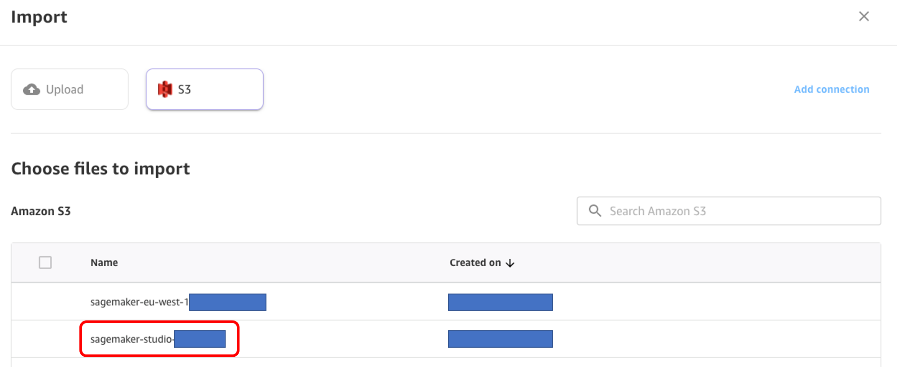
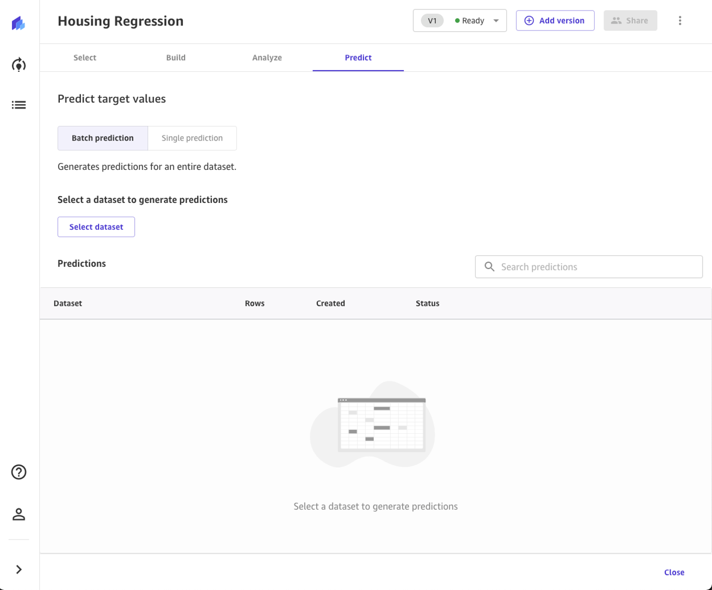

# Lab 2 - Housing Prices (Real Estate)

## Agenda

1. [Overview](#overview)
2. [Upload the dataset to S3 Bucket](#upload-the-dataset-to-s3-bucket)
3. [Import the dataset in Canvas](#import-the-dataset-in-canvas)
4. [Building and Training a ML model](#building-and-training-a-ml-model)
5. [Using the model to generate predictions](#using-the-model-to-generate-predictions)

## Overview

In this lab, you will learn how to use Amazon SageMaker Canvas to import and analyze a dataset for housing prices, and build a ML model to predict pricing without having to write a single line of code. Since the prices can be in any range of real values, this ML problem is called "Regression". The data schema is as follows:

| Column Name                 | Data type | Description                                                  |
| --------------------------- | --------- | ------------------------------------------------------------ |
| latitude                    | DECIMAL   | A measure of how far west a house is; a higher value is farther west |
| longitude                   | DECIMAL   | A measure of how far north a house is; a higher value is farther north |
| housing_median_age          | INT       | Median age of a house within a block; a lower number is a newer building |
| total_rooms                 | INT       | Total number of rooms within a block                         |
| total_bedrooms              | INT       | Total number of bedrooms within a block                      |
| population                  | DECIMAL   | Total number of people residing within a block               |
| households                  | INT       | Total number of households, a group of people residing within a home unit, for a block |
| median_income               | DECIMAL   | Median income for households within a block of houses (measured in tens of thousands of US Dollars) |
| median_house_value (target) | DECIMAL   | Median house value for households within a block (measured in US Dollars) |
| ocean_proximity             | STRING    | Location of the house w.r.t ocean/sea                        |

## Upload the dataset to S3 Bucket

The first step is to download the dataset that we will use. You can download it [here](./Data/housing.csv).

Go to the AWS Management Console, search **S3** in the searchbox on top of your console, then go to **S3** service console.

In the S3 console, click on the **sagemaker-studio-\*** bucket.

> The **sagemaker-studio-\*** bucket was created automatically when you created the SageMaker Studio domain in the **Prerequisites** section. If you follow the **Event Engine** track, the bucket was pre-provisioned by you instructor.
>

Click **Upload**.

On the Upload page, drag and drop the `housing.csv` file you've just downloaded, then click **Upload** at the bottom of the page. Once the upload is complete, you can now click the top-right **Close** button. You should now see the file uploaded in your bucket.

## Import the dataset in Canvas

Go back to the SageMaker Canvas tab created in the **Prerequisites** section. On the left menu, you can click the second icon to head to the Datasets section, then click the **Import** button.

Now, select the bucket where we've previously uploaded our dataset, the **sagemaker-studio-\*** bucket.

You can now select the `housing.csv` file uploaded previously by selecting the checkbox at its left. Two new buttons will pop-up at the bottom of your page: **Preview all** and **Import Data**. Let's choose the first one.

You now face a 100-rows preview of the dataset you're looking to import. Once you're done checking that it's indeed the right one, you can click on **Import Data**.

## Building and Training a ML model

Now, let's head back to the **Models** section of the web page, by clicking the second button on the left menu.

Click on **+ New model**, and provide a name to your model, something like "Housing Prices" or "Housing Regression".

If this is the first time creating a Canvas model, you will be welcomed by an informative pop-up about how to build your first model in 4 simple steps. You can read this through, then come back to this guide.

In the Model view, you will see four tabs, which correspond to the four steps to create a model and use it to generate predictions: **Select**, **Build**, **Analyze**, **Predict**. In the first tab, **Select**, click the radio button to select the `housing.csv` dataset we've uploaded previously. You can see that this dataset comes from S3, it has 10 columns and more than 20K rows. Click the bottom button **Select dataset**.

Canvas will automatically move to the **Build** phase. In this tab, choose the target column, in our case `median_house_value`. Canvas will automatically detect that this is a **numeric prediction** problem (also known as regression). If the wrong model type is detected, you can change it manually with the **Change type** link at the center of the screen.

In the bottom half of the screen, you can take a look at some of the statistics of the dataset, including missing and mismatched values, unique vales, mean and median values. This can also be used to drop some of the columns, if we don't want to use them for the prediction, by simply un-checking them with the left checkbox. For this Lab, we're planning on using all of the available features. You can come back to this step later and try to change some of the features to see the impact on the model training.

Once you've explored this section, it's time to finally train the model! Before building a complete model, it is a good practice to have a general idea about the performances that our model will have by training a **Quick Model**. A quick model trains fewer combinations of models and hyper-parameters in order to prioritize speed over accuracy, especially in cases like ours where we want to prove the value of training an ML model for our use case. Note that quick build is not available for models bigger than 50k rows. Let's go ahead and click **Quick build**.

Now, we wait anywhere from 2 to 15 minutes that the training is done. Since the dataset is small, this will take probably even less than 2 minutes. Once done, Canvas will automatically move to the **Analyze** tab, to show us the results of our quick training:

> Don't worry if the numbers in the below images differ from yours. Machine Learning introduces some stochasticity in the process of training models, which can lead to different results to different builds.

Our model is showing in big numbers a metric for our regression problem, called Root Mean Squared Error (RMSE). This represents a measurement for the spread of predictions, with a lower value indicating more accurate predictions of our target variable. This means that our prediction have a squared error of +-48k$. We will see by how much our prediction are off later.

Let's focus on the first tab, **Overview**. This is the tab that shows us the **Column impact**, or the estimated importance of each column in predicting the target column. This is a very important view, since it gives us information on those features who could give away our target label (this is called target leakage, when one feature importance is disproportionately high with respect to the others) or features that are irrelevant to the problem (very low feature importance). In our case, even the lowest of the column impacts is still significant, so this means that we should keep all features around. We can still try later to remove some of them and see how this impacts the build.

If you want to learn more about how Canvas uses SHAP baselines to bring explainability to Machine Learning, you can check the ["Evaluating Your Model's Performance in Amazon SageMaker Canvas" section ](https://docs.aws.amazon.com/sagemaker/latest/dg/canvas-evaluate-model.html) of the Canvas documentation, as well as the page for [SHAP Baselines for Explainability ](https://docs.aws.amazon.com/sagemaker/latest/dg/clarify-feature-attribute-shap-baselines.html).

When we move to the **Scoring** portion of our analysis, we can actually see a plot representing the distribution of our predicted values with respect to the actual values: this allows us to compute another metric, the Mean Average Error (MAE), which shows our mean difference from the actual value to predict. You can inspect further metrics and get more knowledge by clicking on the **Advanced metrics** button on your right.

Now, you have two options:

1. you can already use this model to run some predictions, by clicking on the button **Predict** at the bottom of the page;
2. you can create a new Version of this model to train with the **Standard Build** process. This will take much longer - about 4-6 hours - but will be much more accurate.

For the sake of this lab, we will go forward with Option 1. Feel free to take your time and run option 2 if you want to.

> Note that training a model with **Standard Build** is necessary to share the model with a Data Scientist with the SageMaker Studio integration. **Predictions** do not require the full build, however they can lack in performances with respect to a fully-trained model.
>

## Using the model to generate predictions

Now that the model is trained, let's use for some predictions. Select **Predict** at the bottom of the **Analyze** page, or choose the **Predict** tab.

Now, choose **Select dataset**, and choose the `housing.csv`. Canvas will use this dataset to generate our predictions. Although it is generally a good idea not to use the same dataset for both training and testing, we're using the same dataset for the sake of simplicity. You can also import another dataset in the selection view if you desire. After a few seconds, the prediction is done and you can click on the eye icon to see a preview of the predictions, or click the download button to download a CSV file containing the full output.

You can also choose to predict one by one values, by selecting **Single prediction** instead of batch prediction. Canvas will show you a view where you can provide manually the values for each feature, and generate a prediction. This is ideal for situations like **what-if scenarios**: e.g. how does the price change if the house is older? What if it's closer to the ocean? How about one with more rooms?

**Congratulations!** You've now completed lab 2. As next steps you can:

1. run this lab again, but building a Standard Model to see its performances;
2. choose another lab to run
