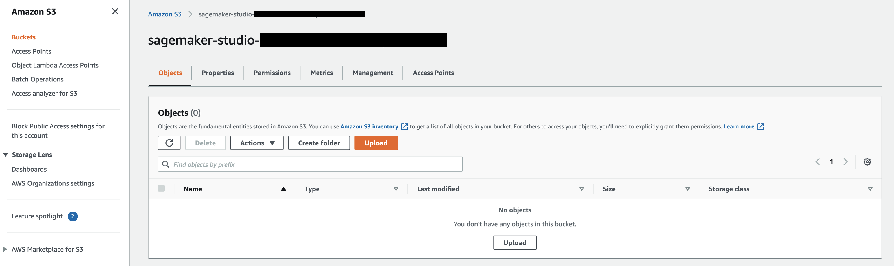

# 實驗室  - 住房價格（房地產）

## 議程

1. [概述](#概述)
2. [將數據集上傳S3存儲桶](#將數據集上傳S3存儲桶)
3. [將數據導入Canvas](#將數據導入Canvas)
4. [建構和訓練ML模型](#建構和訓練ML模型)
5. [使用模型生成預測](#使用模型生成預測)

## 概述

In this lab, 你想學習如何使用 Amazon SageMaker Canvas，匯入與分析一個住房價格的數據集，然後建構一個 ML模型進行預測，並在過程中，無需撰寫一行代碼. 由於住房價格可以是任何實際值，這類ML問題稱之為"回歸"。數據格式如下：

| 欄位名稱                 | 資料型別 | 描述                                                  |
| --------------------------- | --------- | ------------------------------------------------------------ |
| latitude                    | DECIMAL   | 衡量房屋靠近西部的範圍；越靠近西部價值越高 |
| longitude                   | DECIMAL   | 衡量房屋靠近北部的範圍；越靠近北部價值越高 |
| housing_median_age          | INT       | 街區內房屋的中位年齡；數字越小建築物越新 |
| total_rooms                 | INT       | 街區內的房間總數                         |
| total_bedrooms              | INT       | 街區內的臥室總數                      |
| population                  | DECIMAL   | 居住在一個街區中的人數               |
| households                  | INT       | 家庭總數，一群居住在家庭單位內的人 |
| median_income               | DECIMAL   | 房屋街區內家庭的中位收入（以數万美元的價格衡量） |
| median_house_value (target) | DECIMAL   | 一個街區內的家庭價值中位數（以美元計量） |
| ocean_proximity             | STRING    | 房屋的位置，相對於海洋/海洋的距離                       |

## 將數據集上傳S3存儲桶

第一步是下載我們將使用的數據集。您可以到[這裡](./Data/housing.csv)下載。

轉到AWS管理控制台，在控制台頂部的搜索框中尋找 **S3** , 然後去到 **S3** 服務控制台。

在S3控制台中，單擊 **sagemaker-studio-\***存儲桶。

> **sagemaker-studio-\*** 在當初建立 SageMaker Studio domain 的時候， 就已經自動建立。如果你參與 **Event Engine** 活動, 則講師會預先準備存儲桶。

點擊 **Upload**.

在上傳頁面上，拖放剛才下載的`housing.csv`文件，然後單擊頁面底部的 **Upload**。上傳完成後，您可以單擊右上角**Close**按鈕。現在，您應該看到上傳到存儲桶中的文件。

## 將數據導入Canvas

返回到Sagemaker Canvas。在左側菜單上，您可以單擊第二個圖標，進入數據集部分，然後單擊 **Import**按鈕。

現在，選擇之前上傳到 **sagemaker-studio-\***存儲桶的數據集。

現在，您可以通過在其左側選擇複選框來選擇先前上傳的`housing.csv`文件。頁面底部將彈出兩個新的按鈕： **Preview all** 和 **Import Data**。讓我們選擇第一個。

現在，您可以看到要導入的數據集的100筆預覽。完成資料檢查，確定是正確後，您可以單擊 **Import Data**.

## 建構和訓練ML模型

現在，讓我們通過單擊左邊選單上的第二個按鈕回到 **Models**部分。

單擊 **+New Model**，並為您的模型輸入名稱。

如果這是您第一次建立 Canvas模型，那麼您將看到一個彈出式歡迎，其中有關於如何通過4個簡單步驟建構您第一個模型的信息。您可以閱讀此信息，然後回到本實驗指南。

在模型視圖中，您將看到四個選項卡，它們對應於創建模型並使用它來生成預測的四個步驟： **Select**, **Build**, **Analyze**, **Predict**. 在第一個選項卡中，**Select**，單擊“單擊”按鈕以選擇我們之前已上傳的`housing.csv`數據集。 該數據集包括10欄位和20k筆數據。單擊底部的按鈕 **Select dataset**.

Canvas will automatically move to the **Build** phase. In this tab, choose the target column, in our case `median_house_value`. Canvas will automatically detect that this is a **numeric prediction** problem (also known as regression). If the wrong model type is detected, you can change it manually with the **Change type** link at the center of the screen.

Canvas 將自動移動到 **Build**階段。在此選項卡中，選擇目標欄位，在我們的情況下是 `median_house_value`. Canvas 將自動發現，這是 **numeric prediction** 問題（也稱為回歸)。 如果系統挑選的模型類型不正確，您也可以使用屏幕中心的鏈接 **Change type** 加以改變。

在屏幕的下半部，您可以查看數據集的一些統計屬性，包括缺失和不匹配的值，獨特的值，平均值和中位數。如果我們不想使用特定欄位，可以使用左邊的複選框進行檢查，取消特定欄位的勾選。訓練模型的時候， 就不會涵蓋已經取消勾選的欄位。對於此次實驗，我們計劃使用所有可以使用的欄位。您可以稍後再回到此步驟，嘗試選取不同欄位的組合，以檢視對模型訓練的影響。

探索了本節後，是時候訓練模型了！在建立完整的模型前，最好我們對於訓練模型的表現，有一個基本想法。一個 **Quick Model**訓練模型和超參數組合的配對較少，優先考慮速度勝過準確性，尤其當我們希望驗證，訓練模型能夠產生價值的時候。 請注意，Quick Build不適合大於50k筆數的模型。讓我們繼續點擊 **Quick build**。

現在，我們等待2到15分鐘的時間。由於數據集很小，因此可能不需要等到2分鐘。完成後，Canvas 將自動移動到 **Analyze**選項卡，向我們展示快速訓練的結果: 

> 不用擔心以下截屏中的數字是否與您的數字不同。機器學習在模型訓練過程中，會引入了一些隨機性，這將導致產生不同的結果。

我們的模型顯示了我們回歸問題的指標，稱為均方根誤差（RMSE）。這代表預測的分佈情況，數值越低，代表我們對我們的目標的預測更加準確。這裡意味著我們的預測具有 +-48K的均方根誤差。我們之後會再檢視，我們的預測跟實際比較，差距有多大。

讓我們專注於第一個選項卡，**Overview**。這是向我們展示欄位影響 **Column impact**，或這些特徵，在預測目標的重要性。 在我們的案例，即使是影響最低的欄位，仍然具有影響力，這意味著我們應該保留所有欄位。我們稍後還是可以嘗試拿掉其中一些欄位，觀察這將如何影響模型的表現。

如果您想了解更多關於 Canvas使用 SHAP基線，為機器學習帶來的可解釋性，您可以查閱 Canvas 官方文件["Evaluating Your Model's Performance in Amazon SageMaker Canvas" section ](https://docs.aws.amazon.com/sagemaker/latest/dg/canvas-evaluate-model.html)，以及 [SHAP Baselines for Explainability ](https://docs.aws.amazon.com/sagemaker/latest/dg/clarify-feature-attribute-shap-baselines.html).

當我們移動到分析當中的 **Scoring**，我們可以看到一個預測值分佈的圖表：這將使我們能夠計算另一個指標，平均誤差（MAE），這顯示我們的預測與實際值的平均差異。您可以通過單擊右側的 **Advanced metrics**按鈕，進一步檢視指標並獲得更多信息。

現在，您有兩個選擇：

1.您可以通過單擊頁面底部的按鈕 **Predict**來使用此模型進行預測；
2.您也可以建構此模型的新版本，以使用 **Standard Build**流程進行訓練。這將需要更長的時間，大約4-6個小時，但模型可能會比較準確。

今天這個實驗，我們將繼續使用選項1。

> 請注意，訓練 **Standard Build**模型，是與SageMaker Studio 整合，及與數據科學家共享模型的必要條件。 **Predictions** 不需完整的模型建構，但相對於有完整模型建構的表現，可能沒有那麼好。

## 使用模型生成預測

現在完成模型的訓練，我們可以做一些預測。在**Analyze** 頁面底部選擇 **Predict** ，或選擇 **Predict** 選項卡。

現在，選擇 **Select dataset**，然後選擇 `housing.csv`。接下來，在頁面底部選擇 **Generate predictions**。Canvas 將使用此數據集生成我們的預測。儘管通常情況， 我們不會將同一個數據集用於訓練和測試，但為了簡單起見，我們在這裡使用相同的數據集。幾秒鐘後，預測完成。您可以單擊長的很像"眼睛"的圖標做預覽，或單擊 download按鈕下載CSV文件。SageMaker Canvas將提供每筆數據的預測以及預測正確的概率。

您還可以選擇 **Single prediction**一次預測一個值，而不是批次預測。Canvas將向您提供一個介面，可以針對每個欄位的值，進行設定，然後生成預測的結果。 這個適合 **模擬場景** 的應用: 例如，如果房屋年齡較大，價格會如何變化？ 如果房屋靠近海洋，價格會怎樣？如果房屋有更多房間，價格又會怎樣？

**恭喜!** 您現在已經完成了實驗2。作為下一步，您可以：

1. 再次運行這個實驗，但建立 Standard Model以查看其模型的表現；
2. 選擇另一個實驗進行運行