# 實驗 3 - 銷售預測（零售）

> 這個實驗室比其他實驗室花費的時間要長得多，因為它使用 **Standard Build** 選項(大約 3-4 小時)。

## 議程

1. [概述](#概述)
2. [將數據集上傳S3存儲桶](#a將數據集上傳S3存儲桶)
3. [將數據導入Canvas](#將數據導入Canvas)
4. [建構和訓練ML模型](#建構和訓練ML模型)
5. [使用模型生成預測](#使用模型生成預測)

## 概述

在本實驗中，您將擔任電子商務公司銷售部門的業務分析師角色。您將使用零售商店的時間序列歷史銷售數據，來構建一個模型，該模型可用於預測特定零售商店的銷售額。數據格式如下：

| 欄位名稱   | 資料型別  |
| ------------- | ---------- |
| store         | INT        |
| saledate      | TIMESTAMP  |
| sales         | DECIMAL    |
| promo         | INT (0 /1) |
| schoolholiday | INT (0/1)  |

## 將數據集上傳S3存儲桶

第一步是下載我們將要使用的數據集。您可以到[這裡](./Data/store_daily_sales_reduced.csv)下載。

轉到AWS管理控制台，在控制台頂部的搜索框中尋找 **S3**，然後去到 **S3**服務控制台。

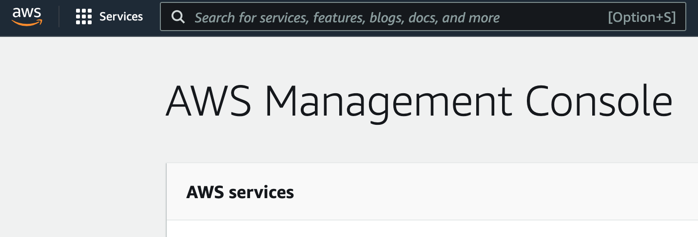

在S3控制台中，點擊 **sagemaker-studio-\***存儲桶。

> **sagemaker-studio-\*** 在當初建立 SageMaker Studio domain的時候，就已自動建立。如果你參與 **Event Engine**活動, 則講師會預先準備存儲桶。

點擊 **Upload**。

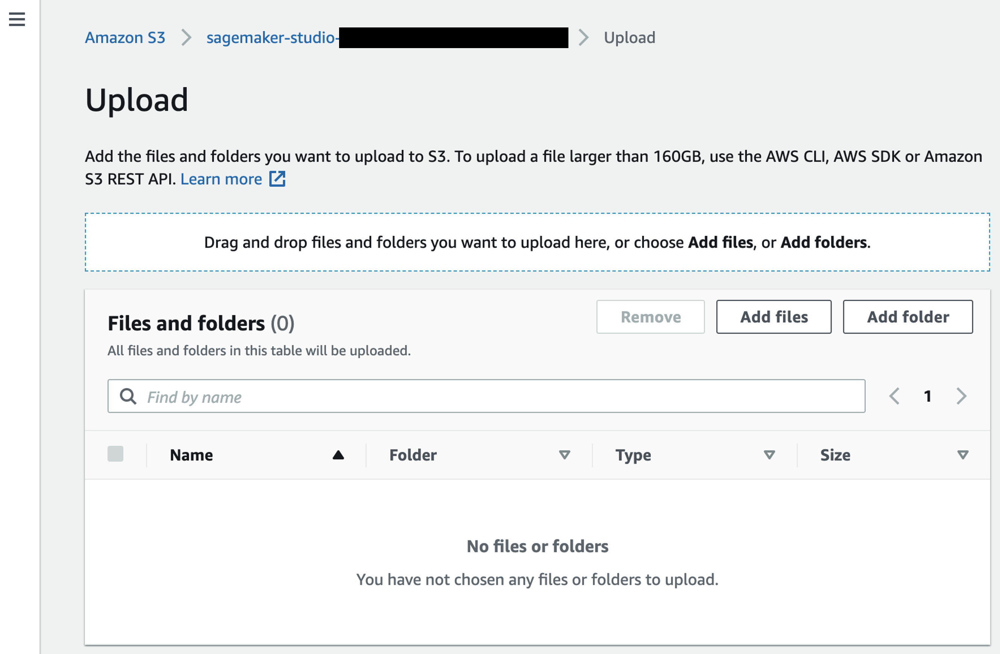

在上傳頁面上，拖放剛才下載的 `store_daily_sales_reduced.csv`文件，然後點擊頁面底部的 **Upload**。上傳完成後，您可點擊右上角 **Close**按鈕。現在，您應該看到上傳到存儲桶中的文件。

## 將數據導入Canvas

返回到 Sagemaker Canvas。在左側選單上，您可點擊第二個圖標，進入數據集部分，然後點擊 **Import**按鈕。

現在，選擇之前上傳到 **sagemaker-studio-\***存儲桶的數據集。

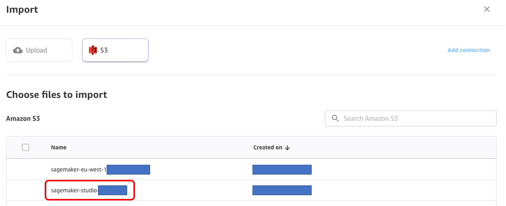

現在，您可以通過在其左側複選框來選擇先前上傳的 `store_daily_sales_reduced.csv`文件。頁面底部將彈出兩個新的按鈕： **Preview all** 和 **Import Data**。讓我們選擇第一個。

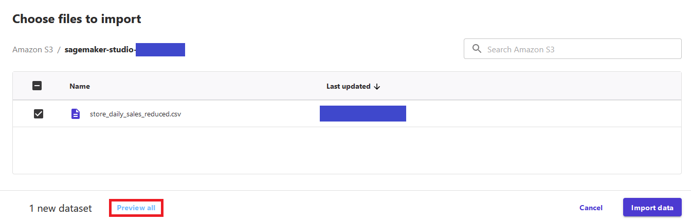

現在，您可預覽要導入的數據集的100筆資料。完成資料檢查，確定正確後，您可點擊 **Import Data**.

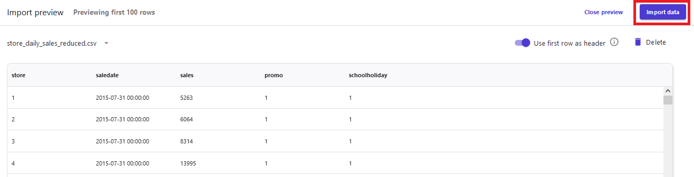

## 建構和訓練ML模型

現在，讓我們通過點擊左邊選單上的第二個按鈕回到 **Models**部分。

點擊 **+New Model**，並為您的模型輸入名稱，例如 `store_sales_forecast_model`，然後點擊 **Create**。

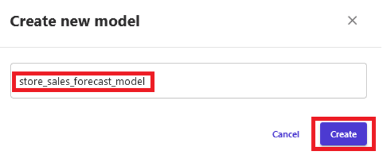

在 **Select dataset**選項卡中，選擇 `store_sales_data`數據集，並點擊底部按鈕 **Select dataset**。

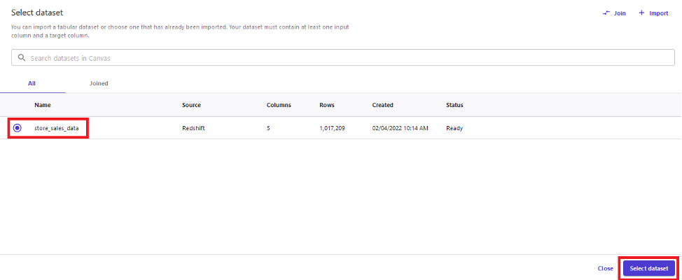

在下一個屏幕上，您可配置模型進行訓練。 您可選擇列欄位查看對應的統計資訊。 在 **Target column** 選擇 `sales`。 Canvas 會自動選擇 **Time series forecasting** 作為模型類型。 點擊 **Configure** 連結。

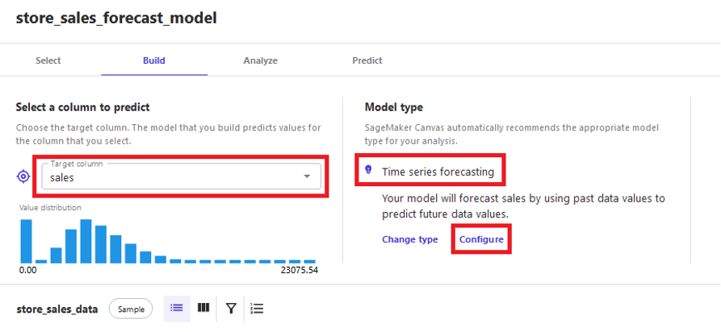

時間序列預測配置，出現彈出螢幕，要求提供一些信息：

- **items field**：在數據集中，識別特定筆數的方式； 針對這個案例，選擇`store`，因為我們計劃預測每家商店的銷售額
- **group column**：如果您對上面的選擇進行邏輯分組，您可在此選擇該功能； 對於這個案例，我們沒有分組欄位。但其他案例中，有可能會出現“州”、“地區”、“國家”或其他商店的分組。
- **time stamp field**：此處選擇 `saledate`，即包含時間戳記的特徵； Canvas 需要的時間戳記格式為 `YYYY-MM-DD HH:mm:ss` （例如：`2022-01-01 01:00:00`）
- 在 **number of Days** 中寫入`120`。

最後，點擊 **Save** 按鈕。

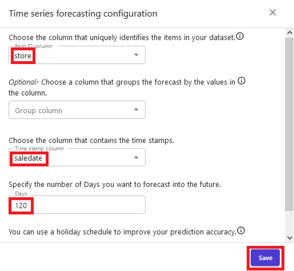

現在配置已經完成，我們準備訓練模型。 在撰寫本實驗時，SageMaker Canvas不支持時間序列預測的 **Quick Build**，因此我們選擇 **Standard Build**，並開始模型訓練。 模型訓練，大約需要 3-4 小時的時間。

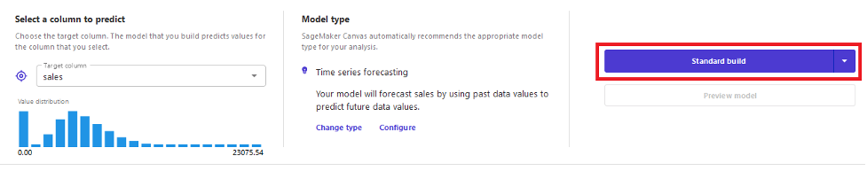

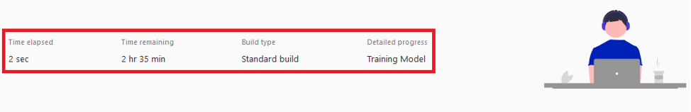

## 使用模型生成預測

模型訓練完成後，您將被引導至 **Analyze**選項卡。您可看到平均預測準確度，及欄位對於預測結果的影響。點擊 **Predict**按鈕，進入 **Predict**選項卡。

現在完成模型的訓練，我們可以做一些預測。在 **Analyze**頁面底部選擇 **Predict**，或選擇 **Predict**選項卡。

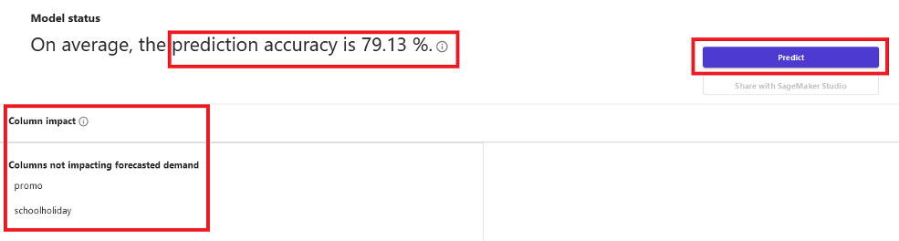

為了創建預測，您必須提供進行預測的日期範圍。 然後，您可為數據集中的所有筆數，或特定筆數，生成預測。

在我們的工作坊中，我們選擇 **Single item**選項，然後可從下拉表中選擇任何數字。我們在這裡選擇數字 5，讓 Canvas 為我們生成預測，顯示平均預測、預測上限、和預測下限。 Canvas 提供兩種結果，建議使用界限而不是單個預測點，您可選擇最適合的選擇。您可透過選擇預測下限，減少資源浪費，也可選擇預測上限，滿足客戶需求。

對於生成的預測，您可點擊 **download**下拉選單，將預測圖表下載為圖檔，或將預測值下載為CSV文件。

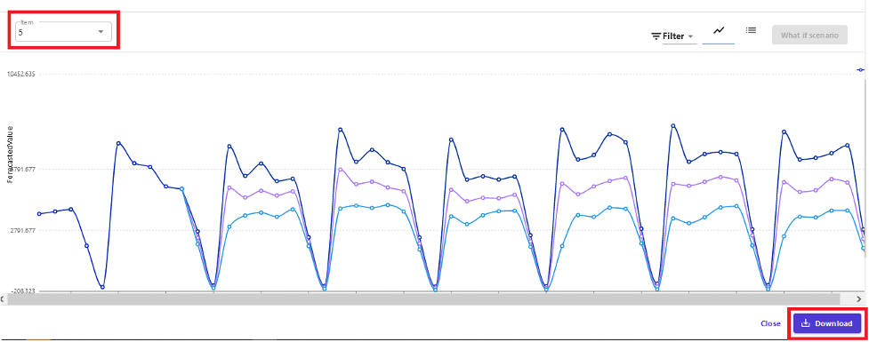

**恭喜!** 您現在已經完成了實驗3。您可選擇要繼續運行的新實驗。
